## 0. Proje Diyagramları

### 0.1. Proje Mimarisi

### 0.2. Transaction Stage Akışı & Fast Complete

### 0.3. Entity Relationship Diagram

```mermaid
erDiagram
    TRANSACTION ||--o{ STAGE_HISTORY : contains
    TRANSACTION ||--|| FINANCIAL_BREAKDOWN : has
    TRANSACTION }o--|| AGENT : "listing agent"
    TRANSACTION }o--|| AGENT : "selling agent"
    FINANCIAL_BREAKDOWN ||--o{ AGENT_SHARE : contains

    TRANSACTION {
        ObjectId _id PK
        string stage
        number totalServiceFee
        string currency
        ObjectId listingAgentId FK
        ObjectId sellingAgentId FK
        date createdAt
        date updatedAt
    }

    AGENT {
        ObjectId _id PK
        string firstName
        string lastName
        date createdAt
        date updatedAt
    }

    FINANCIAL_BREAKDOWN {
        number agencyAmount
        array agentShares
    }

    AGENT_SHARE {
        ObjectId agentId
        string role
        number amount
    }

    STAGE_HISTORY {
        string fromStage
        string toStage
        date changedAt
    }
```

### 0.4. Komisyon Hesaplama Akışı

---

## 1. Problem Analizi ve Hedef

Bu tasarımın amacı, bir emlak ajansındaki satış / kiralama işlemlerinin:

- Yaşam döngüsünü (stages) izlenebilir hale getirmek,
- Toplam hizmet bedelini (service fee) ajans ve ajanlar arasında **otomatik ve hatasız** dağıtmak,
- Her bir işlem için **şeffaf bir finansal breakdown** sunmaktır.

Özellikle manuel süreçlerin (kapora, tapu, ödemeler) ve karmaşık komisyon kurallarının
zaman alıcı ve hataya açık olması problemi üzerine odaklandım.

---

## 2. Mimari Yaklaşım

### 2.1. Mimari

Uygulama, NestJS’in modüler yapısı kullanılarak iki ana domain modülüne ayrıldı:

- `TransactionsModule`
    - İşlem yaşam döngüsü (stages)
    - Komisyon hesaplama tetikleyicileri
    - Finansal breakdown’ın üretilmesi ve saklanması

- `AgentsModule`
    - Ajanların temel bilgilerinin (id, isim, soyisim) yönetimi

Ek olarak, ortak bileşenler `common/` altında toplanacaktır (DTO’lar, filtreler, pipe’lar vb.).

Bu ayrım, **transaction** domain’ini ajan yönetiminden bağımsızlaştırırken,
gelecekte daha karmaşık bir kullanıcı / auth sistemi eklenebilmesine zemin hazırlar.

### 2.2. Single-Agency Varsayımı

Bu case kapsamında, sistemin **tek bir ajans** için çalıştığını varsayıyorum.
Bu, veri modelini basitleştirip asıl odak olan:

- Transaction yaşam döngüsü
- Komisyon hesaplama kuralları

üzerine yoğunlaşmamı sağlıyor.

Gerçek hayatta çoklu ajans senaryosu için `agencyId` gibi alanlar eklenerek
multi-tenant yapıya evrilmek mümkündür.

---

## 3. Veri Modeli Tasarımı (MongoDB)

### 3.1. Transaction Dokümanı

- `_id`: ObjectId
- `stage`: enum
    - `agreement` | `earnest_money` | `title_deed` | `completed` | `canceled`
- `totalServiceFee`: number
- `currency`: string (ör. `"GBP"`)
- `listingAgentId`: ObjectId (referans veya string)
- `sellingAgentId`: ObjectId (referans veya string)
- `financialBreakdown`: embedded subdocument
    - `agencyAmount`: number
    - `agentShares`: array
        - `agentId`
        - `role`: `"listing_agent"` | `"selling_agent"`
        - `amount`: number
- `stageHistory`: array
    - `fromStage`: string
    - `toStage`: string
    - `changedAt`: Date

#### Neden embedded `financialBreakdown`?

- Her transaction, kendi finansal gerçekliğini içerir.
- “Bu işlemden kim, ne kadar kazandı?” sorusuna tek dokümanla cevap verebilmek önemli.
- Sorgulama maliyeti düşük oluyor (join / ekstra koleksiyon gerektirmiyor).

Alternatif olarak breakdown için ayrı bir koleksiyon düşünülebilirdi ancak:

- Ek collection, case kapsamında gereksiz karmaşıklık katacaktı.
- Okuma sıklığı transaction üzerinden olduğu için embedded model daha uygun.

### 3.2. Agent Dokümanı

Basit tutulmuştur:

- `_id`: ObjectId
- `firstName`: string
- `lastName`: string

Bu case için ajanın sadece kimlik ve isim bilgilerinin tutulması yeterlidir.
Kimlik doğrulama, rol yönetimi, ofis/branch bilgisi gibi detaylar scope dışında bırakılmıştır.

---

## 4. İş Mantığı Tasarımı

### 4.1. Transaction Stages – State Machine Yaklaşımı

Transaction stage yönetimi için hafif bir **state machine** yaklaşımı benimsedim.

İzin verilen ana akış:

- Normal akış: `agreement → earnest_money → title_deed → completed`
- Her aşamada **iptal (canceled)** mümkün:
    - Gerçek hayatta işlemler çoğu zaman farklı nedenlerle iptal olabilir.
- `completed` veya `canceled` son durumlar (terminal states) olarak ele alınır.

Invalid geçişler için:

- Örnek: `completed → earnest_money`
- Bu tip geçişler servis katmanında engellenir ve anlamlı bir hata döndürülür.

Bu sayede:

- İşlem yaşam döngüsü **izlenebilir** ve tutarlı olur.
- Yanlışlıkla “geri sarma” gibi anormal durumlar kontrol altında tutulur.

### 4.2. Komisyon Hesaplama Kuralları

Komisyon hesaplama mantığı, `CommissionService` adında ayrı bir domain servisine
izole edilir (service klasörü içinde veya transactions module altında).

Girdi:

- `totalServiceFee`
- `listingAgentId`
- `sellingAgentId`

Kurallar:

- Ajans: %50
- Ajan(lar): %50
- Aynı ajan listing + selling ise: ajan %50 alır.
- Farklı ajanlar ise: her biri %25 alır.

Bu mantık:

- **Saf fonksiyonel** olarak yazılacak (yan etkisiz),
- Jest ile unit testler yazılacaktır.

Bu izolasyon, hem test edilebilirlik hem de gelecekte kuralların karmaşıklaşması durumunda
kolay genişletilebilirlik sağlar.

### 4.3. Commission Policy’nin Sabit Olması

Bu case kapsamında komisyon oranları **kod içinde sabit (hard-coded)** olarak tanımlanacaktır:

- Ajans payı: `0.5`
- Toplam ajan payı: `0.5`

Gerçek hayatta:

- Farklı ajanslar için farklı oranlar,
- Zamanla değişen kampanyalar,
- Ajan bazlı özel oranlar

gibi ihtiyaçlar ortaya çıkabilir. Bu durumda:

- Bir **konfigürasyon tablosu** veya
- Bir **kural motoru (rule engine)**

ile esnek bir yapı kurulabilir. Bu olasılık Design dokümanında bilinçli bir gelecek adım
olarak bırakılmıştır.

---

## 5. API Tasarımı ve Dokümantasyonu

### 5.1. Swagger/OpenAPI Dokümantasyonu

API, @nestjs/swagger kullanılarak kapsamlı bir şekilde dokümante edilmiştir.

#### Swagger Özellikleri

**DTO Dokümantasyonu:**

- Türkçe açıklamalar ile alan amaçları netleştirilmiştir
- Gerçekçi örnek değerler sağlanmıştır (örn: totalServiceFee: 50000, currency: 'TRY')
- Enum değerleri için detaylı açıklamalar ve örnek geçişler eklenmiştir

### 5.2. Ana Endpointler

#### Health Check

- `GET /health`
    - Basit bir “ayakta mıyım?” endpoint’i
    - Monitoring & deployment doğrulaması için

#### Transactions

- `POST /transactions`
    - Yeni işlem oluşturur.
    - Body:
        - `totalServiceFee`
        - `currency`
        - `listingAgentId`
        - `sellingAgentId`
    - Başlangıç stage: `agreement`
    - Response: oluşturulan işlem + ilk financial breakdown (opsiyonel olarak ilk aşamada veya completed olduğunda hesaplanabilir; bu karar implementation aşamasında netleştirilecektir).

- `GET /transactions`
    - Filtrelenebilir liste
    - Query params:
        - `stage`, `agentId`, `fromDate`, `toDate` vb. (minimum bir iki filtre ile başlayabilirim)

- `GET /transactions/:id`
    - Tek işlem detayını getirir
    - `financialBreakdown` ve `stageHistory` alanlarını da içerir.

- `PATCH /transactions/:id/stage`
    - Stage geçişlerini yönetir
    - Body:
        - `toStage`
    - State machine kurallarına göre geçişe izin verir veya hata döner.
    - Eğer `completed` stage’ine geçiliyorsa:
        - Komisyonlar hesaplanır ve `financialBreakdown` içine yazılır.

- `PATCH /transactions/:id/cancel`
    - İşlemi `canceled` stage'ine taşır.
    - Gerekirse iptalin nedenini de body'de alabilir (future work).

- `PATCH /transactions/:id/fast-complete`
    - **Gerçek hayat çözümü:** İşlemi mevcut aşamasından direkt `completed`'e taşır
    - Acil kapanış durumları için (örn: nakit alıcı, hızlı satış)
    - Aradaki tüm stage'leri (`earnest_money`, `title_deed`) otomatik olarak history'ye ekler
    - Komisyonu tek aksiyonla hesaplar ve kaydeder
    - İş yükünü azaltır, hata riskini düşürür
    - Validation: Terminal state'lerden (completed/canceled) izin vermez

#### Agents

- `POST /agents`
    - Yeni ajan oluşturur.
    - Body:
        - `firstName`
        - `lastName`

- `GET /agents`
    - Ajan listesini döner.

> Not: Agent endpoints case’in merkezinde değil, ancak transaction’de kullanılan ajanların
> anlamlı olması ve test/veri üretimi açısından faydalı. Bu nedenle minimal bir Agent domain’i eklenmiştir.

---

## 6. Hata Yönetimi ve Validasyon

- DTO’lar ile:
    - Zorunlu alanlar (totalServiceFee, listingAgentId, sellingAgentId vb.)
    - Tip ve format kontrolleri
- NestJS Pipes (ValidationPipe) ile body / query validasyonu
- Custom hata mesajları:
    - Invalid stage transition (ör. 400 veya 409)
    - Geçersiz toplam fee, eksik agent bilgisi vb.

---

## 7. Test Stratejisi

Öncelikli hedefler:

1. **CommissionService Unit Testleri**
    - Aynı ajan için senaryo
    - Farklı ajanlar için senaryo
    - Edge-case: 0 veya negatif fee durumları (en azından reject edildiği test edilir)

2. **TransactionService Testleri**
    - Geçerli stage geçişleri
    - Geçersiz stage geçişlerinde hata
    - `completed` aşamasına geçerken breakdown hesaplanması

---

## 8. En Zor / Riskli Karar

İlk tasarım aşamasında iki konuyu görece riskli gördüm:

1. Stage yönetiminin ne kadar katı olacağı
2. Breakdown’ı embedded mi yoksa ayrı koleksiyonda mı tutacağım

Şimdilik:

- Stage yönetiminde, case gereksinimini karşılayan ama esnekliği tamamen öldürmeyen bir state machine tercih ettim.
- Breakdown’ı embedded tuttum, çünkü okuma ve izah edilebilirlik bu casede daha önemli.

---

## 9. Gerçek Hayatta Devamında Ne Gelirdi?

Gelecek adımlar için olası geliştirmeler:

- **Kimlik doğrulama (auth) ve yetkilendirme**
    - JWT/OAuth2 entegrasyonu
    - Role-based access control (admin, agent, manager)
- **Daha detaylı auditing**
    - Kim hangi stage değişikliğini yaptı?
    - Hangi IP'den, hangi zamanda?
    - Değişiklik gerekçeleri (notes/comments)
- **Esnek komisyon kuralları için rule engine**
    - Konfigüre edilebilir komisyon oranları
    - Zaman bazlı kampanyalar
    - Ajan bazlı özel oranlar
- **Raporlama ve dashboard'lar**
    - Ajan bazlı gelir raporları
    - Zaman aralığına göre şirket gelirleri
    - Stage bazlı istatistikler (dönüşüm oranları)
- **Multi-tenant mimariye geçiş**
    - Birden fazla ajans için tek backend
    - Ajans bazlı izolasyon ve konfigürasyon

Bu case kapsamında, bu adımlar "geleceğe bırakılmış" ancak tasarım kararları alınırken
bunlar göz önünde bulundurulmuştur.
